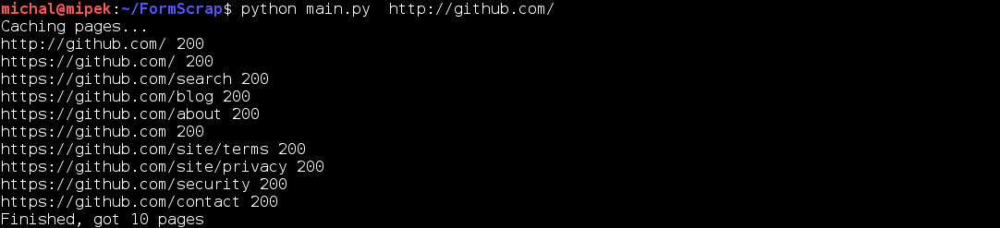
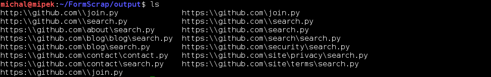
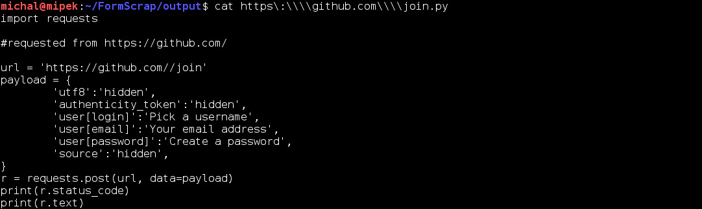

# FormScrap

## What is this?

FormScrap is a script written in python that recursively collects all available forms from a given website and creates easy-to-use request scripts.

##How do I use this?

Simply run main.py with the url as a parameter, example:
```python
python main.py http://google.com/
```

##What do I need?

FormScrap relies on following python libraries:
 * BeautifulSoup
 * urlparse
 * requests
 * codecs

##Are you going to add more features?
Yes!

##Screenshots!






